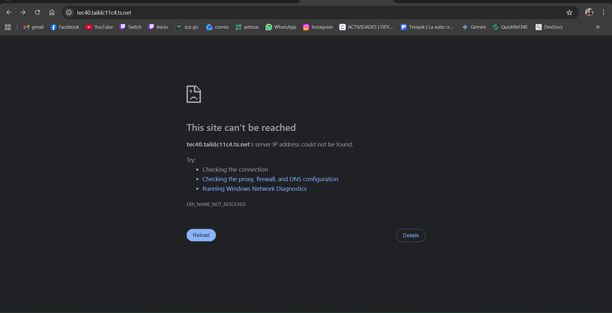

# 🚀 DESPLIEGUE MANUAL - Ejecuta estos comandos directamente

## Paso 1: Conectarse al servidor

```bash
ssh david@100.85.207.81
# Password: a1s2d3f4
```

## Paso 2: Ir al directorio del proyecto

```bash
cd /mnt/data/web/tec40
```

## Paso 3: Crear tabla de usuarios

```bash
docker exec -i tec40-db mysql -u tec40_user -ptec40_pass_2024 bd_tec_40 << 'EOF'
CREATE TABLE IF NOT EXISTS usuarios (
    id bigint unsigned NOT NULL AUTO_INCREMENT,
    nombre varchar(255) NOT NULL,
    apellido_paterno varchar(255),
    apellido_materno varchar(255),
    correo varchar(255) NOT NULL,
    password varchar(255) NOT NULL,
    rol enum('sistemas','coordinacion','docente','prefectura','vinculacion') NOT NULL,
    created_at timestamp NULL DEFAULT NULL,
    updated_at timestamp NULL DEFAULT NULL,
    PRIMARY KEY (id),
    UNIQUE KEY (correo)
) ENGINE=InnoDB DEFAULT CHARSET=utf8mb4 COLLATE=utf8mb4_unicode_ci;
EOF
```

## Paso 4: Crear usuario administrador

```bash
docker exec -i tec40-db mysql -u tec40_user -ptec40_pass_2024 bd_tec_40 << 'EOF'
INSERT INTO usuarios (nombre, apellido_paterno, apellido_materno, correo, password, rol, created_at, updated_at)
VALUES ('Admin', 'Sistema', 'Técnica40', 'admin@tecnica40.edu.mx', '$2y$12$92IXUNpkjO0rOQ5byMi.Ye4oKoEa3Ro9llC/.og/at2.uheWG/igi', 'sistemas', NOW(), NOW())
ON DUPLICATE KEY UPDATE password = VALUES(password);
EOF
```

## Paso 5: Ejecutar migraciones

```bash
docker exec tec40-app php -r "
require 'vendor/autoload.php';
\$app = require_once 'bootstrap/app.php';
\$kernel = \$app->make(Illuminate\Contracts\Console\Kernel::class);
\$status = \$kernel->call('migrate', ['--force' => true]);
echo 'Migraciones: ' . \$status . PHP_EOL;
"
```

## Paso 6: Verificar que todo esté funcionando

```bash
# Ver tablas creadas
docker exec tec40-db mysql -u tec40_user -ptec40_pass_2024 bd_tec_40 -e "SHOW TABLES;"

# Probar la aplicación
curl http://localhost:8081
```

## Paso 7: (Opcional) Configurar Caddy para Tailscale

```bash
# Instalar Caddy si no está
sudo apt update && sudo apt install -y caddy

# Editar configuración
sudo nano /etc/caddy/Caddyfile
```

Agregar:
```
tec40.taildc11c4.ts.net {
    reverse_proxy localhost:8081
}
```

Guardar (Ctrl+O, Enter, Ctrl+X) y recargar:
```bash
sudo systemctl reload caddy
```

---

## ✅ Acceso final

- **URL local**: http://100.85.207.81:8081
- **URL Tailscale**: https://tec40.taildc11c4.ts.net (si configuraste Caddy)
- **Usuario**: admin@tecnica40.edu.mx
- **Password**: password

⚠️ **IMPORTANTE**: Cambia la contraseña después del primer login!

---

## 🐛 Si algo falla

```bash
# Ver logs de la aplicación
docker logs tec40-app

# Ver logs de la base de datos
docker logs tec40-db

# Reiniciar contenedores
docker-compose restart
```
